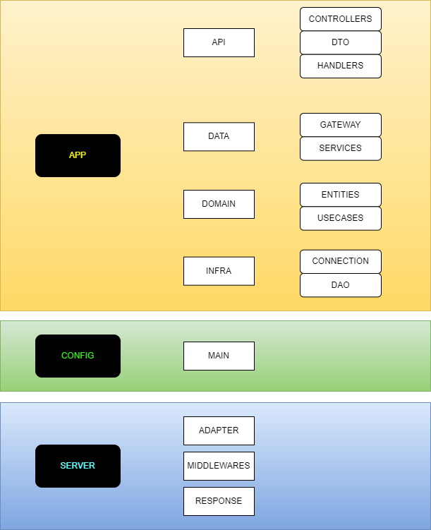

# DART BACKEND TDD CLEAN ARQUITECTURE



A server app built using ,
configured to enable running with [Docker](https://www.docker.com/).

This sample code handles HTTP GET requests to `/clients`.

## Running the sample

### Running with the Dart SDK

You can run the example with the [Dart SDK](https://dart.dev/get-dart)
like this:

```
$ dart run bin/server.dart
Server listening on port 8080
```

And then from a second terminal:

```
$ curl http://0.0.0.0:8080/clients
```

### Running with Docker

If you have [Docker Desktop](https://www.docker.com/get-started) installed, you
can build and run with the `docker` command:

```
$ docker build . -t myserver
$ docker run -it -p 8080:8080 myserver
Server listening on port 8080
```

And then from a second terminal:
```
$ curl http://0.0.0.0:8080/clients
```

You should see the logging printed in the first terminal:

```
2021-05-06T15:47:04.620417  0:00:00.000158 GET     [200] /clients
```

## Clean Arquitecture


### Referencias

- [Washington Developer - YOUTUBE CHANNEL](https://www.youtube.com/watch?v=6tA4WIf0lDI&list=PLK5FPzMuRKlxe8ZDOx7H0OO30R_cazh-q)
- [Washington Developer - GITHUB PAGE](https://github.com/washingtondeveloper/youtube-dart-back-end)
- [postgres - Pub DEV](https://pub.dev/packages/postgres)
